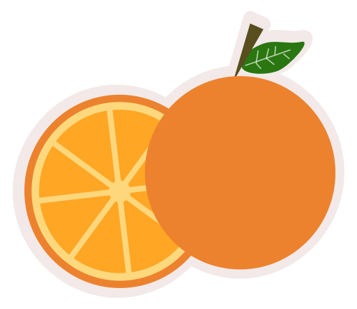

# Fruit Store

###### Install dependencies
`make dependencies`

###### Run unit tests:
`make test`

###### Calculate test's coverage (HTML):
`make cover-html`

###### Run linter:
`make lint`

###### Database operations:
Create a new migrations `migrate-new`
Run all migrations up: `make migrate-up`
Run all migrations down (rollback): `migrate-down`